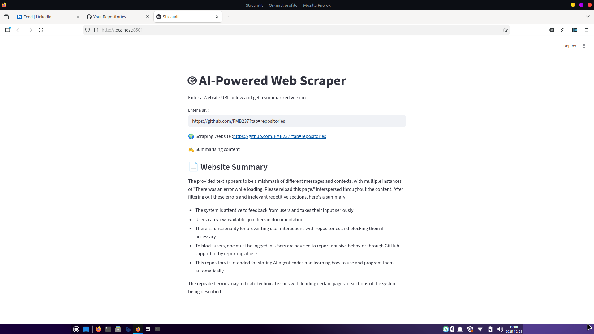

# AI Agents Udemy Course Repository


This repository contains code and projects from my Udemy course on building AI agents. It demonstrates the progression from basic text-based chatbots to advanced AI-powered assistants, including voice interaction, web scraping, and document reading, all using local LLMs like Ollama.

## Overview

The course is structured into four days, each building upon the previous one to introduce new capabilities:

- **Day 1**: Basic AI agents with text input, memory, and web UI using Streamlit.
- **Day 2**: Voice-powered AI assistant with speech recognition and text-to-speech capabilities.
- **Day 3**: AI web scraper integrated with FAISS for efficient data retrieval and conversational memory.
- **Day 4**: AI-powered document reader that processes PDFs, stores content in a vector database (FAISS), and enables question-answering based on documents.

All agents use LangChain for prompt management and Ollama for running local LLMs (e.g., qwen2.5:3b), ensuring privacy and offline functionality.

## Features

- **Conversational Memory**: Agents remember past interactions for context-aware responses.
- **Web UI**: Interactive chat interfaces using Streamlit for user-friendly interaction.
- **Voice Interaction**: Speech-to-text and text-to-speech for hands-free operation (Day 2).
- **Web Scraping**: Ability to scrape and process web pages, with FAISS for vector-based search (Day 3).
- **Document Processing**: Read and analyze PDF documents, store in FAISS, and answer questions based on content (Day 4).
- **Local LLM Integration**: Runs AI models locally via Ollama for privacy and offline use.
- **Modular Code**: Easy to extend and customize for various applications.

## Project Structure

```
AiChatbotUdemyCourse/
├── README.md                 # This comprehensive guide
├── requirements.txt          # Python dependencies for all days
├── .gitignore                # Git ignore file
├── day1/                     # Day 1: Basic AI Agents
│   ├── basic_ai_agent.py     # Combined script with multiple versions
│   ├── version1.py           # Web UI version
│   ├── version2.py           # Alternative Web UI implementation
│   ├── packages.sh           # Installation script for Day 1
├── day2/                     # Day 2: Voice Assistant
│   ├── ai_voice_assistant.py # Main voice assistant script
│   ├── ai_voice_assistant_ui.py # UI version of voice assistant
│   ├── version2.py           # Web UI version (similar to day1)
│   ├── Readme.md             # Day 2 specific notes
│   └── dependencies.sh       # Installation script for Day 2
├── day3/                     # Day 3: AI Web Scraper with FAISS
│   ├── ai_web_scraper.py     # Basic web scraper script
│   ├── ai_web_scrapper_faiss.py # Web scraper with FAISS integration
│   ├── Readme.md             # Day 3 specific notes
│   └── dependencies.sh       # Installation script for Day 3
├── day4/                     # Day 4: AI-Powered Document Reader
│   ├── ai_document_reader.py # Main document reader script
│   ├── version2.py           # Alternative implementation
│   ├── Readme.md             # Day 4 specific notes
│   └── dependencies.sh       # Installation script for Day 4
└── other files...            # Additional scripts (e.g., guessnumber.py, Recall.py)
```

## Prerequisites

- Python 3.8+
- Ollama installed and running locally (download from [ollama.ai](https://ollama.ai))
- Pull required models: `ollama pull qwen2.5:3b` (or your preferred model)
- Microphone for voice input (Day 2)
- Speakers/headphones for voice output (Day 2)
- Internet connection for web scraping (Day 3)
- PDF files for document reading (Day 4)

## Installation

1. Clone the repository:
   ```bash
   git clone https://github.com/FMB237/AiChatbotUdemyCourse.git
   cd AiChatbotUdemyCourse
   ```

2. Install Python dependencies:
   ```bash
   pip install -r requirements.txt
   ```

   Or run the day-specific scripts for targeted installations:
   - For Day 1: `./day1/packages.sh`
   - For Day 2: `./day2/dependencies.sh`
   - For Day 3: `./day3/dependencies.sh`
   - For Day 4: `./day4/dependencies.sh`

3. Ensure Ollama is running and the required models are pulled.

## Usage

### Day 1: Basic AI Agents


#### Text-based CLI Agent
Run the basic agent without UI:
```bash
python day1/basic_ai_agent.py
```
Type questions and get responses. Type 'exit' to quit.

#### Web UI Agent
Launch the Streamlit app:
```bash
streamlit run day1/version1.py
# or
streamlit run day1/version2.py
```
Open the provided URL in your browser for an interactive chat with memory.

### Day 2: Voice Assistant

#### CLI Voice Assistant
Run the voice-powered assistant:
```bash
python day2/ai_voice_assistant.py
```
Speak commands/questions. The AI will listen, process, and respond via speech. Say "exit" or "stop" to quit.

#### Web UI Voice Assistant
Launch the Streamlit UI version:
```bash
streamlit run day2/ai_voice_assistant_ui.py
```
Interact via the web interface with voice capabilities.

### Day 3: AI Web Scraper with FAISS



Run the web scraper with FAISS integration:
```bash
python day3/ai_web_scrapper_faiss.py
```
The script scrapes web pages, processes content, and uses FAISS for efficient querying. Interact via CLI or integrate with other components.

### Day 4: AI-Powered Document Reader

Run the document reader:
```bash
streamlit run day4/ai_document_reader.py
```
Upload PDF documents, process them, store in FAISS, and ask questions based on the content. The app provides a GUI for file upload and AI-summarized reports.

## Notes

- Adjust the LLM model in the scripts if you have different Ollama models installed.
- For voice features (Day 2), ensure your microphone is working and permissions are granted.
- Web scraping (Day 3) requires a stable internet connection and respect for website terms of service.
- Document reading (Day 4) supports PDF files; ensure files are accessible.
- The web UI versions include chat history display and are built with Streamlit for ease of use.
- Code includes commented-out sections for different implementations and customizations.

## Contributing

This is a personal learning repository, but feel free to fork, experiment, and contribute improvements!

## License

Not yet desidered